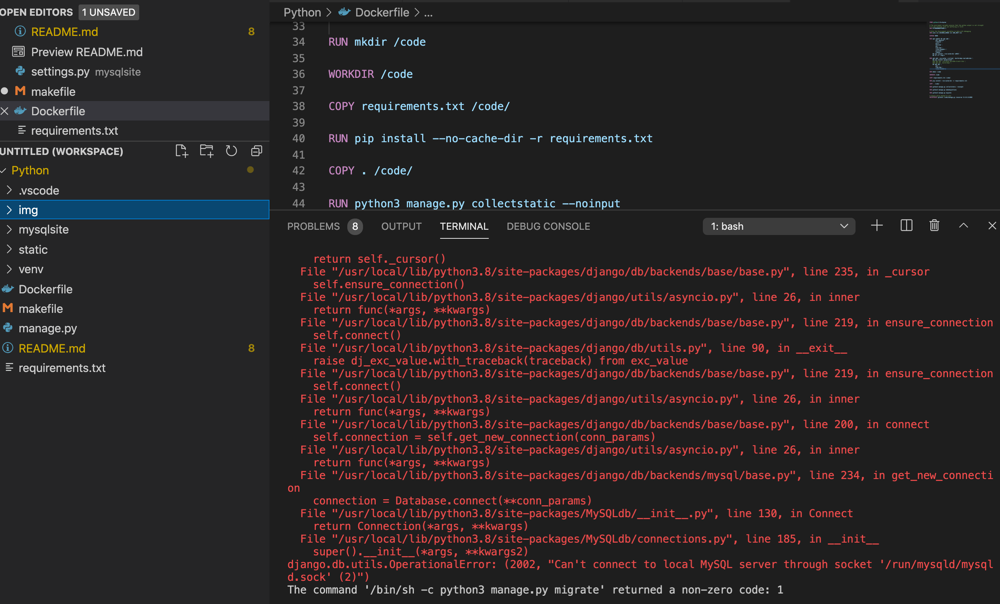

# OVERVIEW

This is a very small project to try to get a Django app connecting to a MySQL
database on my local computer.

It must be able to connect when run on the local computer and it also needs to
be able to connect when using a Dockerfile.

Originally, I found it easy to get it to connect when run on my local computer (mac), but when I tried to connect to MySQL through a Dockerfile, it did not work.   I have tried installing mysqlclient onto the docker image and I have tried using python mysql connector, but I cannot get either of them to work.   Unfortunately the examples and instructions that I have found so far are very  limited.

The actual Django site doesn't really display anything.   It does however run the migrations and create the auth and django tables in the MySQL database (this doesn't work when run from the Dockerfile).

I try to connect to the MySQL database on my local machine using the following adjustment in the settings.py file:

> 'HOST': 'host.docker.internal',

### MySQL Setup

---

To setup a database on a MySQL server, you could use the following commands:

```SQL
CREATE DATABASE dbMarksMySQL;
```
To create a new user use one of the following and make appropriate adjustments:
```SQL
CREATE USER 'junk_admin'@'%' IDENTIFIED BY 'password';
```
Other commands that may be useful:
```SQL
USE dbMarksMySQL
GRANT ALL PRIVILEGES ON dbMarksMySQL.* TO 'junk_admin'@'%';
FLUSH PRIVILEGES;
SHOW GRANTS FOR 'junk_admin'@'%';
```

Please note that a test database or permissions have not been added here.

### REQUIREMENTS FILE

---

* In the requirements.txt file I have removed the number for the mysqlclient, ie:
    ```
    ...
    Django==3.2
    mysqlclient
    pytz==2021.1
    ...
    ```

### MAKE FILE

---

I have created a makefile to help clean things up, create a virtual environment and run the project.   There are 3 main commands for running the project:

* make clean                  - Used to clean the environment up.
* make venv                   - Used to create the virtual environment from requirements.txt
* make run-local-debug        - This runs the Django project on my localhost in debug mode.
* make run-local              - This runs the Django project on my localhost.
* make run-dock               - This builds and runs the Django project within a container defined by the local Dockerfile.

### SYSTEM AND TYPICAL ERRORS

---

I am running this code on a Macbook Pro with macOS Catalina Version 10.15.7 and there is
a MySQL 5.7.29 database installed.

This image should display a typical error that I get:



